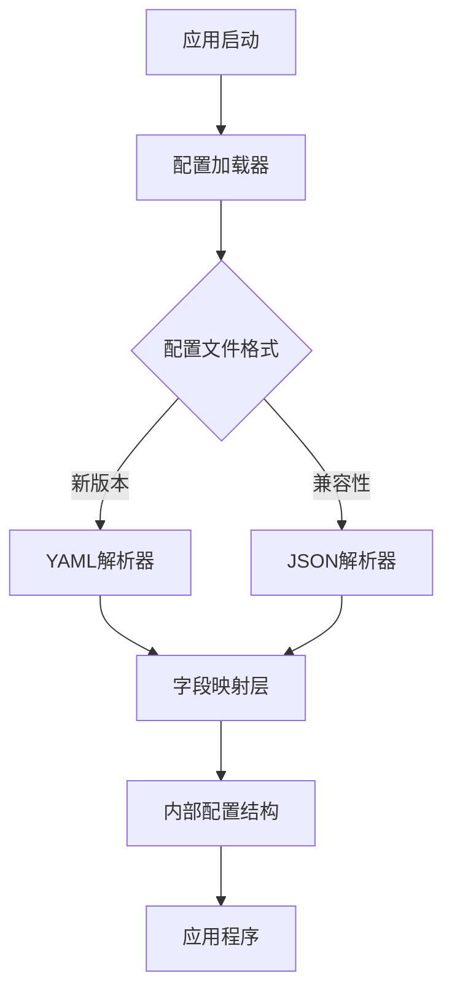

# 项目本地化改进设计文档

## 概述

本设计文档描述了如何将现有的Go语言卡片管理项目进行全面的中文本地化改进。主要包括配置文件格式从JSON迁移到YAML、配置字段中文化、移除冗余配置项、以及代码注释的完全中文化。

## 架构

### 配置系统架构变更



### 本地化处理流程


## 组件和接口

### 1. 配置加载器 (ConfigLoader)

**职责:** 负责从YAML文件加载配置并映射到内部结构

**接口设计:**
```go
// 配置加载器接口
type ConfigLoader interface {
    // 从YAML文件加载配置
    LoadFromYAML(path string) (*Config, error)
    // 验证配置有效性
    Validate(config *Config) error
}
```

### 2. 字段映射器 (FieldMapper)

**职责:** 处理中文字段名到内部结构字段的映射

**映射规则:**
```yaml
# YAML配置文件中的中文字段
角色卡根目录: "D:\\yw\\AI\\角色卡"
酒馆角色卡目录: "D:\\Software\\AI\\SillyTavern\\SillyTavern\\data\\default-user\\characters"
酒馆公共目录: "D:\\Software\\AI\\SillyTavern\\SillyTavern\\public"
代理地址: "http://127.0.0.1:1233"
端口: 3600
```

### 3. 路径构建器 (PathBuilder)

**职责:** 动态构建niko等子目录路径，替代硬编码的nikoPath

**接口设计:**
```go
// 路径构建器
type PathBuilder struct {
    tavernPublicPath string
}

// 构建niko目录路径
func (pb *PathBuilder) BuildNikoPath() string {
    return filepath.Join(pb.tavernPublicPath, "niko")
}
```

## 数据模型

### 配置结构体更新

```go
// 统一配置结构体 - 支持YAML标签和中文字段映射
type Config struct {
    // 角色卡根目录
    CharactersRootPath   string `yaml:"角色卡根目录" json:"charactersRootPath"`
    // 酒馆角色卡目录
    TavernCharactersPath string `yaml:"酒馆角色卡目录" json:"tavernCharactersPath"`
    // 酒馆公共目录
    TavernPublicPath     string `yaml:"酒馆公共目录" json:"tavernPublicPath"`
    // 端口号
    Port                 int    `yaml:"端口" json:"port"`
    // 代理地址
    Proxy                string `yaml:"代理地址" json:"proxy"`
    
    // 本地化工具配置
    Localizer LocalizerConfig `yaml:"本地化工具" json:"localizer"`
}

// 本地化工具配置结构体
type LocalizerConfig struct {
    // 基础路径
    BasePath        string   `yaml:"基础路径" json:"base_path"`
    // 强制代理列表
    ForceProxyList  []string `yaml:"强制代理列表" json:"force_proxy_list"`
}
```

### YAML配置文件格式

**统一配置文件 (config/config.yaml):**
```yaml
# 卡片管理器统一配置文件
# 本配置文件包含主应用和本地化工具的所有配置参数

# 角色卡根目录 - 存放所有角色卡文件的主目录
角色卡根目录: "D:\\yw\\AI\\角色卡"

# 酒馆角色卡目录 - SillyTavern应用中角色卡的存储位置
酒馆角色卡目录: "D:\\Software\\AI\\SillyTavern\\SillyTavern\\data\\default-user\\characters"

# 酒馆公共目录 - SillyTavern的公共资源目录
# 注意：niko等子目录将基于此路径自动构建
酒馆公共目录: "D:\\Software\\AI\\SillyTavern\\SillyTavern\\public"

# 代理地址 - 网络请求使用的代理服务器地址
代理地址: "http://127.0.0.1:1233"

# 端口 - 应用程序监听的端口号
端口: 3600

# 本地化工具配置
本地化工具:
  # 基础路径 - 本地化资源的基础存储路径（通常与酒馆公共目录相同）
  基础路径: "D:\\Software\\AI\\SillyTavern\\SillyTavern\\public"
  
  # 强制代理列表 - 必须通过代理访问的域名列表
  强制代理列表:
    - "gitgud.io"
    - "raw.githubusercontent.com"
    - "cdn.jsdelivr.net"
    - "github.com"
    - "fonts.googleapis.com"
    - "files.catbox.moe"
```

## 正确性属性

*属性是一个特征或行为，应该在系统的所有有效执行中保持为真——本质上是关于系统应该做什么的正式声明。属性作为人类可读规范和机器可验证正确性保证之间的桥梁。*

现在让我分析需求文档中的验收标准，确定哪些可以转换为可测试的属性：

基于预工作分析，我识别出以下可测试的正确性属性：

### 属性反思

在编写属性之前，让我检查是否有逻辑上冗余的属性：

- 属性2.1和5.2都测试字段映射正确性，可以合并为一个综合属性
- 属性1.1和6.1都测试YAML加载，但针对不同配置文件，应保持独立
- 其他属性各自验证不同的功能点，无冗余

### 正确性属性

**属性 1: YAML配置加载**
*对于任何* 有效的YAML配置文件，配置系统应该能够成功加载并返回正确的配置对象
**验证需求: 1.1, 6.1**

**属性 2: 中文注释处理**
*对于任何* 包含中文注释的YAML配置文件，配置系统应该正确解析配置内容而忽略注释
**验证需求: 1.2**

**属性 3: 中文错误信息**
*对于任何* 无效的配置文件，配置系统应该返回包含中文字符的错误信息
**验证需求: 1.3**

**属性 4: 字段映射正确性**
*对于任何* 包含中文字段名的配置，配置系统应该正确映射到内部结构体的对应字段
**验证需求: 2.1, 5.2**

**属性 5: nikoPath字段排除**
*对于任何* 加载的配置对象，都不应该包含nikoPath字段
**验证需求: 3.1**

**属性 6: 动态路径构建**
*对于任何* 有效的酒馆公共目录路径，路径构建器应该正确构建niko子目录路径
**验证需求: 3.2**

**属性 7: 配置兼容性**
*对于任何* 有效的配置，应用程序的核心功能应该在配置格式改变后继续正常工作
**验证需求: 5.1**

## 错误处理

### 配置加载错误

1. **文件不存在错误**
   - 提供中文错误信息："配置文件不存在: {文件路径}"
   - 建议用户检查文件路径

2. **YAML格式错误**
   - 提供中文错误信息："配置文件格式错误: {具体错误}"
   - 指出错误行号和列号

3. **字段验证错误**
   - 提供中文错误信息："配置字段无效: {字段名} - {错误原因}"
   - 提供有效值的示例

### 路径处理错误

1. **路径不存在**
   - 记录警告日志但不中断程序
   - 提供中文警告信息："路径不存在，请检查配置: {路径}"

2. **权限错误**
   - 提供中文错误信息："无法访问路径，请检查权限: {路径}"

## 测试策略

### 双重测试方法

本项目将采用单元测试和基于属性的测试相结合的方法：

**单元测试:**
- 验证特定的配置加载示例
- 测试错误条件和边界情况
- 验证字段映射的具体案例

**基于属性的测试:**
- 验证配置系统在各种输入下的通用属性
- 使用随机生成的配置数据进行全面测试
- 每个属性测试运行最少100次迭代

### 基于属性的测试配置

我们将使用Go的testing包结合property-based testing库（如gopter）来实现属性测试：

- 最少100次迭代每个属性测试
- 每个属性测试必须引用其设计文档属性
- 标签格式: **Feature: project-localization, Property {number}: {property_text}**

### 测试覆盖范围

**配置加载测试:**
- 有效YAML文件的加载
- 包含中文注释的文件处理
- 无效文件的错误处理
- 字段映射的正确性

**路径构建测试:**
- niko路径的动态构建
- 各种输入路径的处理
- 路径分隔符的正确处理

**兼容性测试:**
- 现有功能在配置改变后的工作状态
- 新旧配置格式的对比验证

### 测试数据生成

**配置文件生成器:**
- 生成有效的YAML配置文件
- 生成包含各种中文注释的文件
- 生成无效格式的文件用于错误测试

**路径生成器:**
- 生成各种格式的文件路径
- 包括Windows和Unix风格的路径
- 生成包含中文字符的路径